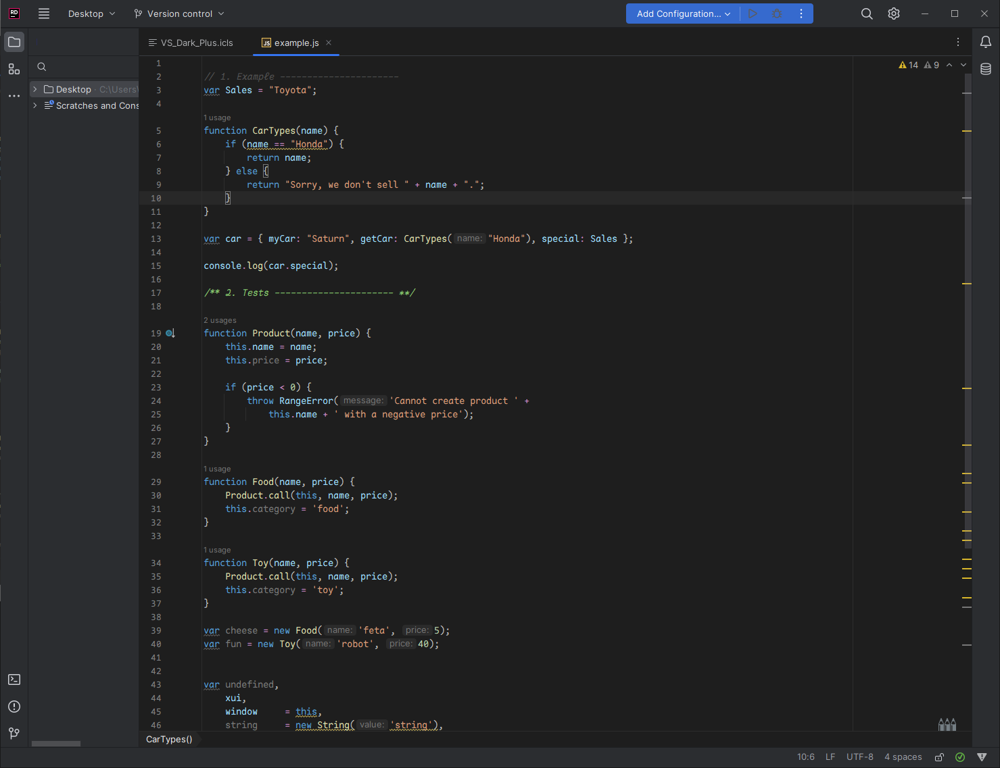

# Rider - VS Dark Plus Theme

--- 

installation : download the [.icls file](https://github.com/fatcheetah/Rider_vs_dark_plus-theme/blob/master/VS_Dark_Plus.icls) and drag over your Rider.
Then select it from the color-scheme options in settings.

---

## Examples

+ C#

+ JS

Font used in examples - [Maple-Font](https://github.com/subframe7536/Maple-font)
Theme inspired by (https://github.com/tcd/dark-plus-syntax)
